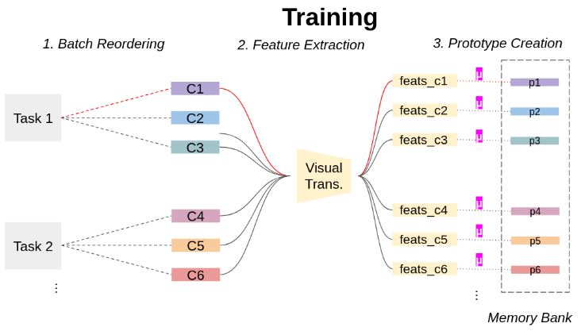

# off-the-shelf-cl


<div align="center">

</div>


This repo hosts the official implementation of the paper *_"Simpler is Better: off-the-shelf Continual Learning Through Pretrained Backbones"_* accepted at Transformers 4 Vision Workshop of CVPR 2022. [Paper](https://arxiv.org/pdf/2205.01586.pdf)

# How To Run 

You can run the `experiments.sh` to perform the paper experiments. Otherwise run by selecting a model and a dataset :

```bash
python off_the_shelf.py --model resnet18 --dataset CIFAR100
```

we support all the models from the `timm` package and as datasets you can use any dataset from the `continuum` package that respect the Class Incremental scenario (for more info look the experiment script for the tested combinations).


# Cite

If you use the code, please cite:

```bibtex
@misc{pelosin2022simpler,
    author = {Pelosin, Francesco},
    title = {Simpler is Better: off-the-shelf Continual Learning Through Pretrained Backbones},
    publisher = Transformers 4 Vision Workshop (CVPR 2022),
    year = {2022},
    }
```
